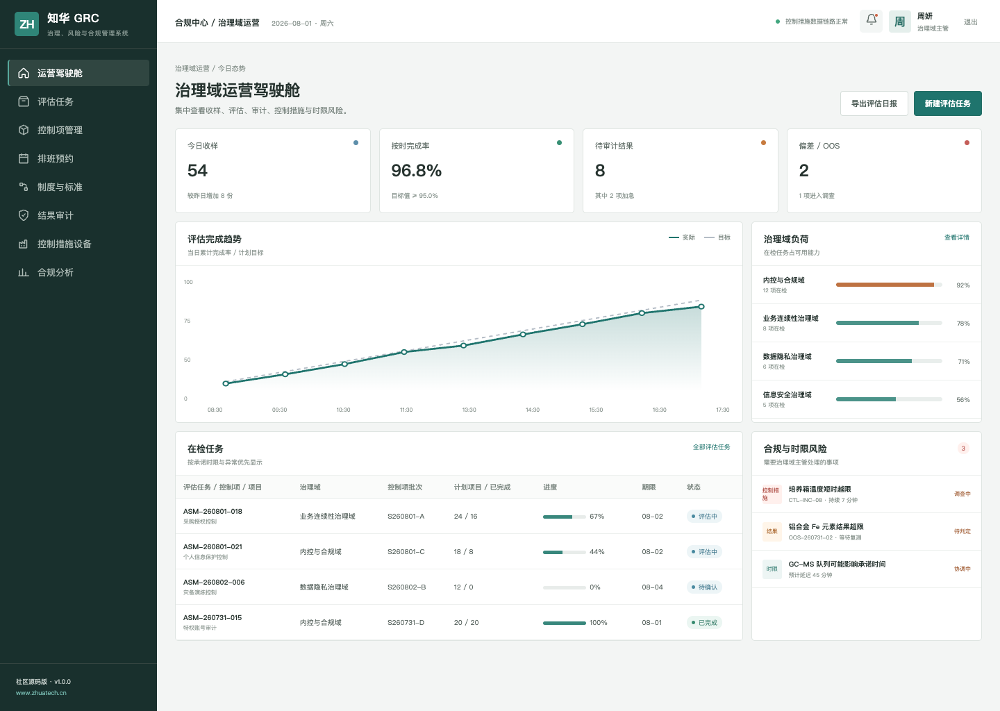
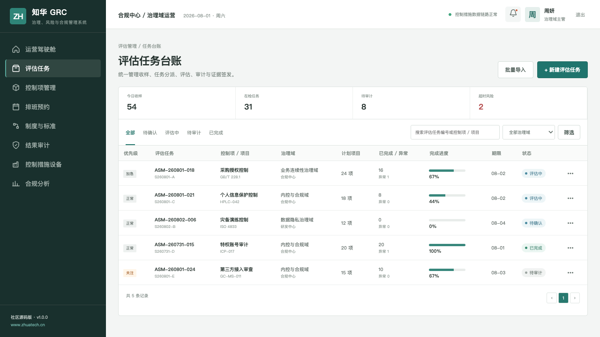
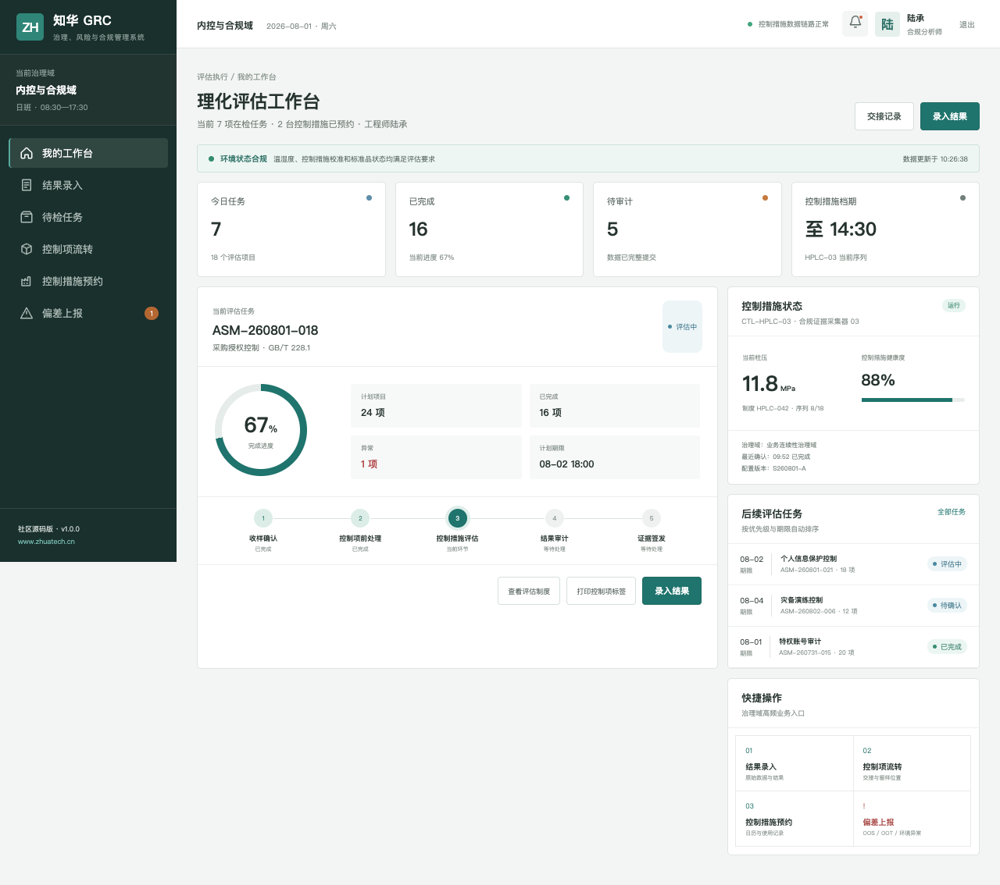

# ZhuaTech GRC｜知华科技治理、风险与合规管理系统

> 把制度、风险、控制、审计与证据连成可追溯的治理闭环。

[](backend/pom.xml) [](frontend/package.json) [](compose.yaml) [](LICENSE)

ZhuaTech GRC 是知华科技（上海如静知华信息科技有限公司）维护的治理、风险与合规管理系统社区源码版。项目采用 Java + Vue 前后端分离架构，既提供管理驾驶舱，也提供适配一线岗位的响应式 H5 工作台。企业服务与产品信息见[知华科技官网](https://www.zhuatech.cn/)。

## 业务主线

```text
风险识别 → 控制设计 → 合规评估 → 整改跟踪 → 审计取证
```

1. 治理域、制度库与控制矩阵
2. 风险评估、审计发现与整改计划
3. 证据留痕、时限预警与合规分析

## 真实界面

### 治理域运营驾驶舱



### 评估任务台账



### 合规分析师工作台



## 控制有效性评估

新增 `POST /api/admin/control-effectiveness`，按控制设计、运行效果、证据覆盖、例外数量、逾期整改和关键控制属性计算有效性分数，输出 `EFFECTIVE / PARTIAL / INEFFECTIVE` 评级与整改动作。结果用于学习演示，不替代正式审计或合规结论。

## 工程结构

| 部分 | 技术与职责 |
| --- | --- |
| 后端 | Java 21、Spring Boot、Spring Security、JPA、Flyway |
| 前端 | Vue 3、Pinia、Vue Router、Axios、Vite，响应式管理端与 H5 岗位端 |
| 数据 | MySQL 8；H2 集成测试 |
| 交付 | Docker Compose、Nginx、环境变量配置 |

Java 工程包名为 `cn.zhuatech.grc`，数据库名为 `zhuatech_grc`。角色覆盖合规分析师、治理域主管、质量审计、系统管理员。

## 五分钟运行

仅看演示界面：

```bash
cd frontend
npm install
npm run dev:demo
```

打开 `http://localhost:5173`。管理端账号 `planner / Demo@2026`，岗位端账号 `operator / Demo@2026`。

完整启动：

```bash
cp .env.example .env
# 修改数据库密码与 JWT_SECRET
docker compose up --build
```

## 部署前须知

仓库中的账号、客户、指标、工单和经营数据均为虚构演示数据。正式落地时应更换默认密码与 JWT 密钥，配置 HTTPS、最小权限、数据库备份、操作审计、脱敏策略，并按照所在行业完成安全与合规评估。

## 许可与咨询

本工程仅允许个人、非商业性的学习、研究和技术交流，**不得商用**。企业内部使用、生产部署、SaaS、客户交付、收费培训、咨询实施及品牌替换，均须事先取得上海如静知华信息科技有限公司书面授权。完整条款见 [LICENSE](LICENSE)。

需要深度开发、私有化部署、系统集成或商业授权，请访问[知华科技官网](https://www.zhuatech.cn/)，也可扫码添加微信咨询：

| 微信咨询 1 | 微信咨询 2 |
| --- | --- |
|  |  |

搜索关键词：GRC 源码、风险合规系统、内控管理、审计整改、Java GRC、Vue GRC、知华科技、上海如静知华信息科技有限公司。

## 剩余风险决策

新增 `POST /api/grc/insights/residual-risk-decision`，按固有风险、控制有效性、财务敞口、监管影响、未关闭发现和证据时效计算剩余风险，输出 `ACCEPT / MITIGATE / ESCALATE`，并形成风险接受或委员会升级动作。

## 企业级控制证据有效性门禁

新增 `POST /api/enterprise/grc/control-evidence-gate`，检查证据充分性与时效、职责分离、例外审批、整改逾期及抽样覆盖，返回 `EFFECTIVE / REVIEW / INEFFECTIVE`。详见 [控制证据说明](docs/ENTERPRISE_CONTROL_EVIDENCE.md)。
